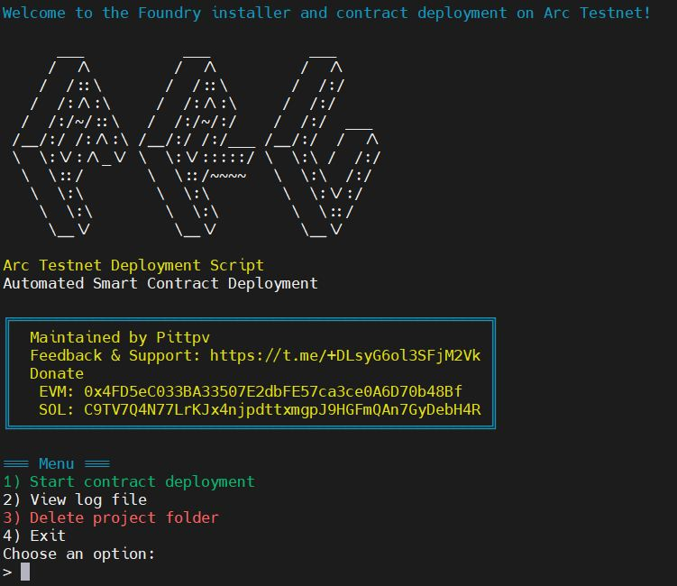

# Arc Testnet Contract Deployment Script

**Description in:**
- [🇷🇺 На Русском](../ "Русская версия описания")



Automated script for deploying smart contracts to Arc Testnet using Foundry.

## 🚀 Features

- **Automatic Foundry Installation** - the script independently installs and configures Foundry
- **Multilingual Interface** - support for Russian and English languages
- **Flexible Wallet Management**:
    - Create a new wallet
    - Import an existing wallet via private key
- **Full test development cycle based on official documentation**:
    - Project initialization
    - Contract creation and compilation
    - Running tests
    - Deployment to Arc Testnet
- **Automatic Variable Management** - creation and updating of the `.env` file
- **Detailed Logging** - all actions are recorded in a log file
- **Interactive Menu** - convenient user interface

## 🛠 Installation and Launch

1. **Requirements**:
   The script will check for the necessary components and offer to install any missing ones.

2. **First launch or Update**:
   ```bash
   curl -o arc_deploy.sh https://raw.githubusercontent.com/pittpv/arc-network/main/arc_deploy.sh && chmod +x arc_deploy.sh && ./arc_deploy.sh
   ```
   For subsequent launches, use the command:
   ```bash
   cd $HOME && ./arc_deploy.sh
   ```

## 📖 How to Use

### Main Menu

After launching the script, you will see the main menu with 4 options:

1. **Start contract deployment** - the main deployment process
2. **View log file** - view the log file directly in the terminal
3. **Delete project folder** - clean up created files
4. **Exit** - terminate the script

### Deployment Process

The script performs several sequential steps:

1. **Foundry Check** - automatic installation if necessary
2. **Project Initialization** - creating the Foundry project structure
3. **Environment Setup** - creating a `.env` file with the RPC URL
4. **Contract Creation** - generating `HelloArchitect.sol`
5. **Test Setup** - creating and running unit tests
6. **Wallet Management** - choice between creating a new one or importing an existing one
7. **Getting Test Tokens** - instructions for using the faucet
8. **Contract Deployment** - deployment to Arc Testnet
9. **Contract Creation Verification** - instructions for using the network explorer
10. **Contract Interaction** - calling functions for verification

## 🔧 Technical Details

### Created Files

- `hello-arc/` - project directory
- `hello-arc/.env` - file with environment variables
- `arc_deployment.log` - execution log file

### Environment Variables

The script automatically creates and updates the `.env` file with the following variables:

```env
ARC_TESTNET_RPC_URL="https://rpc.testnet.arc.network"
PRIVATE_KEY="your_private_key"
WALLET_ADDRESS="your_wallet_address"
HELLOARCHITECT_ADDRESS="deployed_contract_address"
TXHASH="deployment_transaction_hash"
```

### Smart Contract

The script creates a simple `HelloArchitect` contract with functions:
- `getGreeting()` - get the current greeting
- `setGreeting()` - set a new greeting
- `GreetingChanged` event for tracking changes

## 🌐 Useful Links

- [Arc Testnet Explorer](https://testnet.arcscan.app) - Arc testnet explorer
- [Circle Faucet](https://faucet.circle.com) - get test USDC
- [Arc Network Documentation](https://docs.arc.network)

## 🐛 Debugging and Logs

- All actions are logged in `arc_deployment.log`
- To view the log file in the terminal, use option 2 in the main menu (but it's easier to open in an editor)
- Logs include timestamps and details of each step

## ✍️ Feedback

Author [Pittpv](https://x.com/pittpv)

**Donate**

- EVM: `0x4FD5eC033BA33507E2dbFE57ca3ce0A6D70b48Bf`
- SOL: `C9TV7Q4N77LrKJx4njpdttxmgpJ9HGFmQAn7GyDebH4R`

Any questions, bug reports, or feedback:

https://t.me/+DLsyG6ol3SFjM2Vk

⭐️ Don't forget to star the repository
